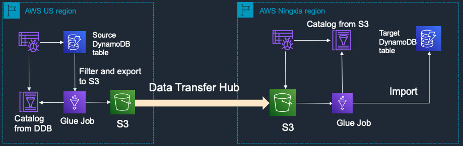
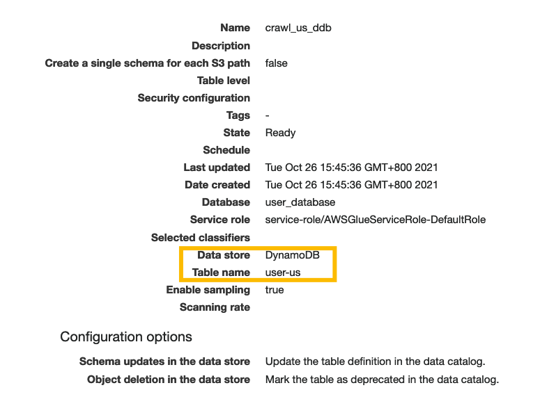
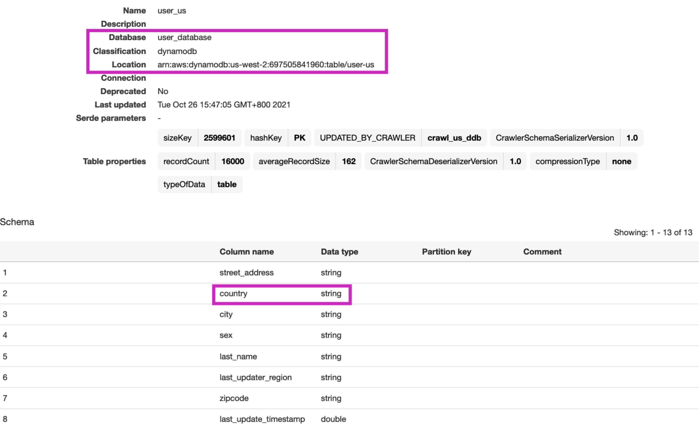
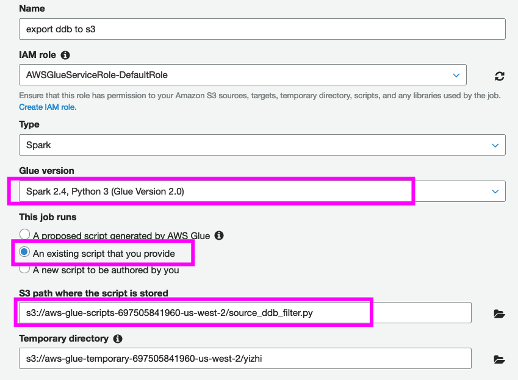
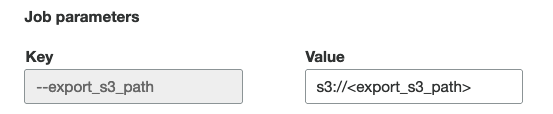
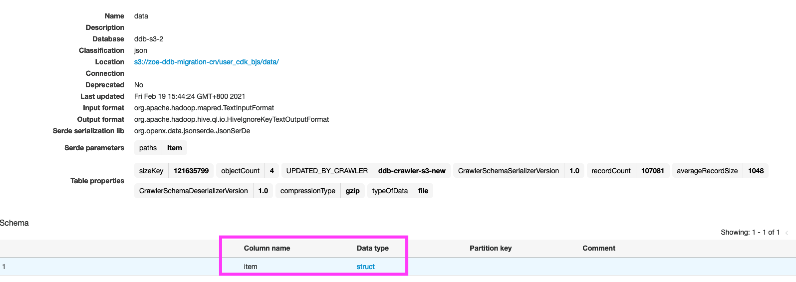

# DynamoDB Migration with Filtering

## Background

- Migration of DynamoDB table from AWS global region to China regions
- [DynamoDB cross region replication](https://github.com/aws-samples/aws-dynamodb-cross-region-replication) provides a nice example of continous bi-directional replication but doesn't cover the inital migration. This PoC can be combined with the former as a total solution for DynamoDB migration and replication. 
- Due to data privacy law, **filtering** on the tables is required before migration
- Internet network is not stable and the migration step over Internet requires reliable architecture

## Architecture

Filter and export to S3 and replicate to China

- Using Glue, crawl and filter DynamoDB table to export to S3 in global region
- Replicate to S3 in China using S3 Plugin of [Data Transfer Hub](https://www.amazonaws.cn/en/solutions/data-transfer-hub/
  )
- Use Glue to load data from S3 to DynamoDB



## Setup

#### Setup US region (source table filtering to S3)

We will use the sample data that's generated from the [DynamoDB cross region replication](https://github.com/aws-samples/aws-dynamodb-cross-region-replication) which is a fake user profile table where in every item of the table, there is field "country". The Glue job will filter on this field. 

1. Glue Crawler

Setup Glue Crawler on US region to crawl over source DynamoDB table



The catalog will be as below



2. Upload ETL script

```bash
git clone https://github.com/yizhizoe/dynamodb-init-migration.git
aws s3 cp source_ddb_filter.py s3://aws-glue-scripts-{account_id}-us-west-2/ --region us-west-2
```

3. Set up and run Glue ETL job

Create Glue job as below



In Job parameter, input the key "export_s3_bucket" and the bucket for export in US region.



After creating the job, run the job directly.

#### Set up Data Transfer Hub

Follow the [deployment guide](https://github.com/awslabs/amazon-s3-data-replication-hub-plugin/blob/main/docs/DEPLOYMENT_EN.md) to set up Data Transfer Hub. Add the replication from the source <export_s3_path> to the s3 path in China region. The Data Transfer Hub transfers Amazon S3 objects between AWS China regions and Global regions has auto retry mechanism and error handling so as to provide high resiliency in data transfer over Internet. As it also supports incremental data transfer, the setup for s3 replication can be one-time setup and you can reuse the export path for multiple tables replication. 

#### Setup in China regions

1. Set up Glue crawler in China region to crawl over the s3 target



Note that after 